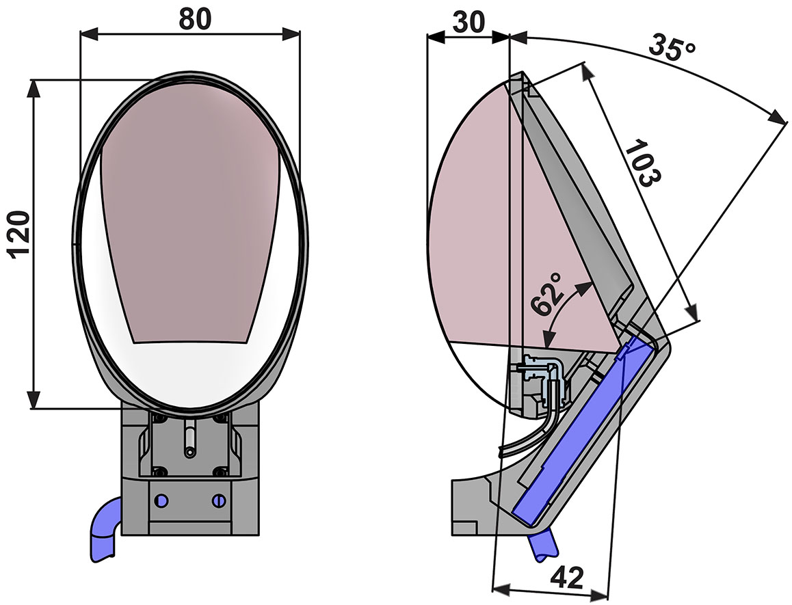
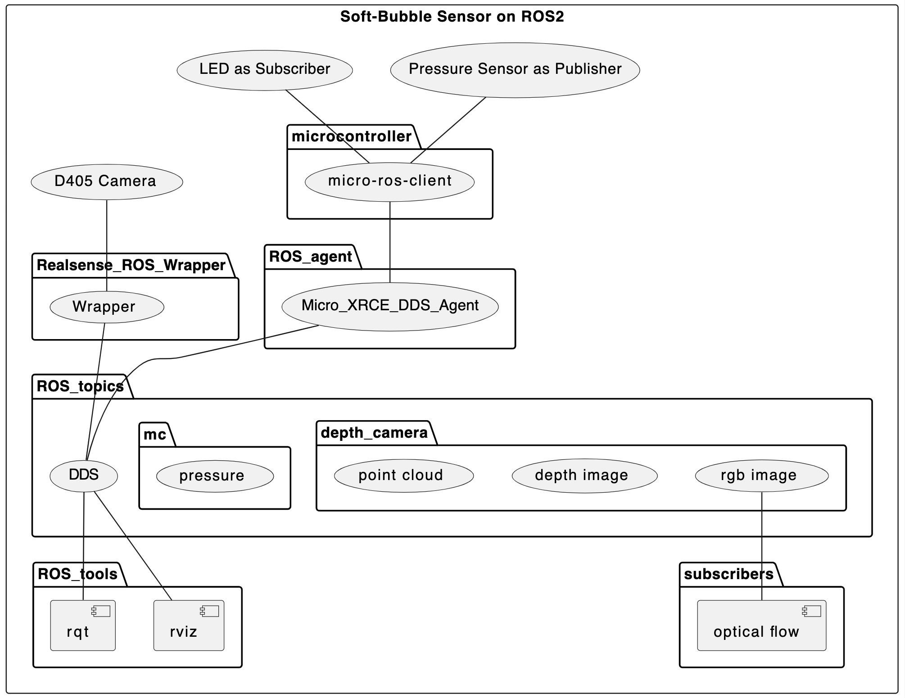
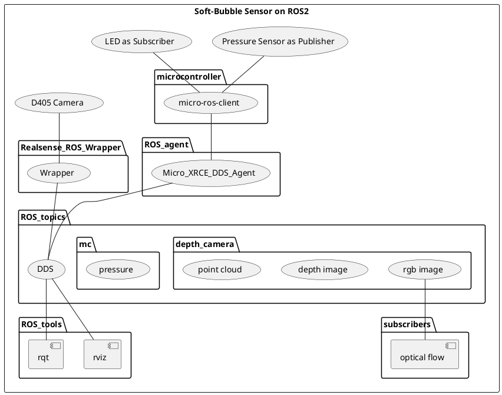

# Punyo Soft-Bubble Sensor

[Overview](#overview) // [Installation](#installation) // [Demos](#demos) // [License](#license)

<center></center>

# Overview



The **Punyo Soft-Bubble Sensor** is a visuotactile sensor developed as part of TRI’s effort to push manipulation capabilities in soft robotics. Soft robotics with integrated sensing opens up many possibilities. 

Using a highly compliant material that is inflated to form a bubble, sensors are used on the inside to measure deformation of the material. Measurements of the material (in the form of pressure, depth, and image data) provide high-density contact geometry and force information that can enable applications in areas like:
1) Human-Robot Interaction such as a smooth object handover from a robot to a human, 
2) Robust gripping where the nature of the compliant material gives added grip strength, and 
3) Pose estimation that can assist when grabbing a tool or item.

This repository contains code to work with the Punyo Soft-Bubble Sensor. It's made available to enable researchers and developers to work with it using ROS2. 


# Structure

- `connectors`
	- `micro_ros_agent` - ROS2 Micro-ROS agent that consumes Micro-ROS client messages (listening to messages on a serial point) and writes the data to ROS2. The standalone agent is available at https://micro-xrce-dds.docs.eprosima.com/en/latest/installation.html#install-agent
- `construction`
	- `gripper` - build instructions to make your own gripper. Note that these instructions are for the bubble based on the pico flexx (1) sensor.
	- `pattern` - a pattern generator for the pico flexx (1) sensor.
- `depth_sensors` - supported depth sensors
	- ` intel_realsense_d405` - Interface with an Intel D405 camera.
- `pressure_sensors` - collection of firmware for pressure sensors
	- `micro_ros_bubble` - A micro-ROS client using micro_ros_arduino as a pre-compiled binary. Cconnects with a micro-ROS agent running on a PC. Reads one MPRLS pressure sensor and controls one neopixel LED.
- `scripts`
	- `start_flow` - Reads in camera data and uses optical flow to estimate shear force
	- `start_demo` - Music demo using pressure readings


# Components
<center></center>




# Installation Overview
We've tested the Punyo Bubble Kit using:

* Ubuntu 20.04
	* ROS2 Foxy or Galactic
* Ubuntu 22.04
	* ROS2 Humble
* Camera Sensor SDK
	* Intel RealSense SDK 2.0
* Arduino IDE (optional)
	* [Arduino IDE Installation](#Arduino-IDE-Installation)
* Punyo Soft-Bubble Sensor Kit package
* Micro XRCE agent


# Installation

## Step 1: Install the ROS2 distribution
* Unbuntu 20.04
	* ROS2 Galactic https://docs.ros.org/en/galactic/Installation/Ubuntu-Install-Debians.html
	* Use the `ros-galactic-desktop` to get the recommended packages.

* Unbuntu 22.04
	* ROS2 Humble https://docs.ros.org/en/humble/Installation/Ubuntu-Install-Debians.html
	* Use the `ros-humble-desktop` to get the recommended packages.

## Step 2: Install the SDK to use a D405 stereo depth camera
* Install the RealSenseSDK 2.0 
	* Note: Intel support for the D405 Camera is only available in ROS2, not ROS 1. 
	* To install the pre-built SDK packages (Linux DKMS), following the instructions here: https://github.com/IntelRealSense/librealsense/blob/master/doc/distribution_linux.md#installing-the-packages
	* Make sure to install the development packages too:
		* librealsense2-dev
		* librealsense2-dbg

## Step 3: Clone the project
Note the use of ```recurse-submodules``` to get the Intel Realsense package as a submodule.
```
git clone --recurse-submodules git@github.shared-services.aws.tri.global:robotics/punyo-bubble.git
```
## Step 4: Prep to build
```
cd punyo-bubble/ros2_ws
```
### Install the build dependencies for colcon

```
sudo apt install python3-colcon-common-extensions
```

### Install the dependencies for the RAFT optical flow algorithm
```
pip3 install torch
pip3 install torchvision
pip3 install --upgrade typing-extensions
```

### Install the dependencies for RealSense
(these are the steps from https://github.com/IntelRealSense/realsense-ros/tree/ros2-beta)
```
sudo apt-get install python3-rosdep -y

sudo rosdep init

rosdep update --include-eol-distros # galactic EOL was Nov-2022

# Be sure to change the distro as needed on your machine
# rosdep install -i --from-path src --rosdistro galactic --skip-keys=librealsense2 -y
rosdep install -i --from-path src --rosdistro humble --skip-keys=librealsense2 -y

```

## Step 5: Build the workspace
```
# Be sure to change the distro as needed on your machine
source /opt/ros/humble/setup.bash
cd punyo-bubble/ros2_ws

# Build the packages
colcon build

# If you need to build specific packages, you can select them.
# colcon build --packages-select punyo
```

# Using the Bubble Sensor

## ROS2 Components
### 1. Publish Depth Data: RealSense
The easiest method is to use the following script to launch a publisher for the camera.

*Option 1*
```
$ cd punyo-bubble/scripts
$ ./start_camera1.sh
```

Or, if you want to set the initial parameters for the camera, you can use launch the ros2 package with arguments for realsense.

*Option 2*
```
cd punyo-bubble/ros2_ws
source /opt/ros/humble/setup.bash
source install/setup.bash

ros2 launch realsense2_camera rs_launch.py pointcloud.enable:=false

# Not all filter parameters appear to work via the command line.
ros2 launch realsense2_camera rs_launch.py colorizer.enable:=true colorizer.color_scheme:=3 depth_module.enable_auto_exposure.1:=false depth_module.profile:=640x480x30 depth_module.exposure:=10000 depth_module.gain:=128 pointcloud.enable:=false 

# For some additional notes on the post_processing filters:
# See https://github.com/IntelRealSense/librealsense/blob/master/doc/post-processing-filters.md

```

### 2. Modify the RealSense camera parameters, using:

#### Option 1: rqt (dynamic reconfigure UI panel)

Running RQT is fairly straightforward. You can use the convenience script if you like.

*Option 1.A*
Open a new terminal window.
```
$ cd punyo-bubble/scripts
$ ./start_rqt.sh
```

*Option 1.B*
``` 
cd punyo-bubble/ros2_ws
source /opt/ros/humble/setup.bash
rqt
```

Now that you RQT is running, you can then navigate to:

`Plugins > Configuration > Dynamic Reconfigure`

Under the `Parameter Reconfigure` panel, there is an option to set the camera properties.
Make the following changes:

```
colorizer.enable: true
depth_module.enable_auto_exposure: false
depth_module.gain 128
depth_module.exposure 20000
```

#### Option 2: using ros2 param set
You can also set parameters without launching RQT. Use your terminal to run commands like:

NOTE: Make sure to use the right path for your camera. Intel's Realsense wrapper defaults to /camera/camera but that can be edited using the `start_camera1.sh` script.
```
ros2 param set /camera/camera colorizer.enable true
ros2 param set /camera/camera depth_module.enable_auto_exposure false
ros2 param set /camera/camera depth_module.gain 128
ros2 param set /camera/camera depth_module.exposure 20000
```

## Visualizing the Depth Data
### Option 1: RQT
RQT is handy because it has built-in plots and image views. It also allows you to launch the dynamic reconfiguration and send specific messages.

```
cd ros2_ws
source /opt/ros/humble/setup.bash

rqt
```

The main panels to use for the bubble are:
plot: pressure data
image: color image
image: depth image
image: optical flow
plot: shear magnitude

### Option 2: ROS2 RViz
RViz also allows you to visualize the incoming data. It supports point clouds.

You can enable pointcloud data by changing:
`pointcloud.enable:=false` to `pointcloud.enable:=true`
in the start_camera1.sh (and start_camera2.sh) script

This should show you 2 image panels (RS depth and RGB) and a point cloud window.
```
cd ros2_ws
source /opt/ros/humble/setup.bash
source install/setup.bash

ros2 run rviz2 rviz2 -d config/punyo.rviz
```

If the punyo.rviz configuration file does not work, you can set up the pointcloud visualizer by setting the following:
* Add a PointCloud2 element
* Global: Fixed Frame

You may need to reboot after installation if you get an error about `failing to create an opengl context`

## Image Processing Node

This is an example of processing the image data to compute optical flow.

Option 1
```
$ cd punyo-bubble/ros_ws
$ source /opt/ros/humble/setup.bash
$ source install/setup.bash
$ ros2 run punyo bubble_image_subscriber --ros-args --params-file src/punyo/punyo/config/bubble.yaml
```

Option 2
```
$ cd punyo-bubble/scripts
$ ./start_flow.sh
```

This will show two image panels. One shows the RGB image with superimposed flow vectors. The other shows the optical flow for the current frame relative to the baseline frame using a colorwheel visualization.

The optical flow image is published as:
`/bubble_1/flow`

The flow vectors can be used to estimate shear force. These shear force estimates may be used to trigger events.

These shear estimates are published on a topic called:
`/bubble_1/force`
and the x and y values of the shear force torque wrench are available as:

```
/bubble_1/force/data[0]
/bubble_1/force/data[1]
```

To get the magnitude of the largest shear vector, the value is available as:
```
/bubble_1/force/data[6]
```

You can switch between two optical flow algorithms.

In `src/punyo/punyo/config/bubble.yaml` you can switch:

Farneback
```
    optical_flow_parameter: 1
```
RAFT - You can also set the Pytorch device mode
```
    optical_flow_parameter: 2
    device_parameter: cpu or cuda
```


## ROS2 + Micro-ROS

### 1. Getting Pressure Data into ROS 2
To get pressure data into ROS 2, we need to connect the Micro-ROS client running on the microcontroller with the ROS 2 distributed data service with the help of a XRCE-DDS agent.

Start the Micro-ros agent to publish the data received from the microcontroller (MC).

** IMPORTANT: Before running the agent**
The client running on the MC uses the references style of creating ROS2 entities. This means that you need to update the `ros.ref` to match the serial number of your microcontroller. If you run the agent without updating the `ros.ref` file, you will see an error stating that the entity was not found. 

For more details on the refs format, see https://micro.ros.org/docs/tutorials/advanced/create_dds_entities_by_ref/ or check the contents of the `start_pressure1.sh` script.
To find out the serial number you should be using, you can run the script as-is, and an error will appear in the logs indicating the serial number of your MC. Alternatively, you can check your devices under `/dev/serial/by-id` on your pc.

There isn't variable support in the refs format, and so you will need to copy/paste the serial number into 8 locations.
e.g. change `bubble_35A4E5A250555733362E3120FF091A1E` to `bubble_yourserialnumber` 

Be sure to keep the prefixes (`rt/`) and suffices (`__dr` `__dw` `__t`) intact

**IMPORTANT: Configuring whether to broadcast topics or keep them on localhost**

By default, the `start_...` scripts and the `ros.ref` configuration file will keep the topics local to the pc you are running on. You can keep the localhost only mode:

*localhost option in ref file*
```
				<interfaceWhiteList>
					<address>127.0.0.1</address>
				</interfaceWhiteList>set_en
```

*localhost option in set_env.sh script*

`export ROS_LOCALHOST_ONLY=1`


You can switch to the broadcasting mode with:

*localhost option in ref file*

```
<!-- Remove or comment out the following block -->
<!--
				<interfaceWhiteList>
					<address>127.0.0.1</address>
				</interfaceWhiteList>
-->
```

*localhost option in set_env.sh script*

`export ROS_LOCALHOST_ONLY=0`

**Option 1: Using a locally-installed Micro XRCE-DDS agent.**

To install it, go the section "Installing the Agent standalone" at https://micro-xrce-dds.docs.eprosima.com/en/latest/installation.html#install-agent

*NOTE: Ubuntu 22.04/jammy users*
You may run into a build issue as jammy uses Openssl 3.x and the full Micro XRCE-DDS agent build references Openssl 1.1.1 (used for Ubuntu 20.04)

To work around this, you can just build the uagent target as follows:

```
git clone https://github.com/eProsima/Micro-XRCE-DDS-Agent.git
cd Micro-XRCE-DDS-Agent
mkdir build && cd build
cmake ..
make uagent # <---- note the specific target
# sudo make install # <--- run this if you want to install it systemwide, otherwise just run it from your build directory 
```

Once installed, run the following:
```
$ MicroXRCEAgent serial --dev /dev/ttyACM0 -b 115200 -v 6 -r ros.ref
```
Make sure that the user you are running this under is a member of the dialout group. If you are unable to add the user to that group, you can run the command using `sudo`.

If there is a problem reading data from the serial port, your user may need to be a part of the dialout group for permissions on your serial port.

To add the current user to the dialout group:
```
sudo usermod -a -G dialout $USERNAME
```

You must log out and log in again for updated group permissions to take effect.

See the latter half of https://www.arduino.cc/en/Guide/Linux for more info.

If you can't install the MicroXRCEagent, you can use a docker image to run the agent.

**Option 2: Using a docker image to run the Micro XRCE-DDS agent**

Note: As of Jan-4-2023, there isn't a docker image built for jammy yet.

```
$ sudo apt install docker.io
$ sudo docker run -it --rm -v /dev:/dev --privileged --net=host microros/micro-ros-agent:galactic serial --dev /dev/ttyACM0 -v6 -r ros.ref
```

### 2. Viewing the pressure data in ROS 2

In RQT:
Navigate to Plugins > Visualization > Plot
to get a plot panel added to the RQT screen.

With the plot placeholder in RQT, you can then add the pressure data in one of two ways:
1) In the Topic path shown in the plot panel that you just added, start entering `/bubble` (note that the leading slash may already by there) so that RQT will auto-populate the drop-down with the topics that start with `/bubble`. 
Once you see entries, you can hit down-arrow to scroll through the options. Pick the one that ends in `pressure` and add `/data` to the full topic name so that the pressure data is plotted. If you don't add `/data`, the data will not be plotted.
2) You can use RQT's Topic Monitor to drag and drop the pressure `data` over to the plot panel. Go to Plugins > Topics > Topic Monitor. Click the expand arrow to expand the pressure topic. You should then see `data`. Drag and drop the `data` over to the plot. The plot should be updated automatically.


## Troubleshooting
### ROS2 localhost publishing

### Topics
To see the topics being published:
```
cd punyo-bubble/scripts
source set_env.sh
ros2 topic list
```
### Pressure data
Sometimes the micro-ros client on the microcontroller may need to be reset, especially if pressure data is not being sent. Check the `CLIENT_README.md` for more details.

Unplug and plug the USB hub back into your PC.

Use the reset button on the microcontroller.

Restart the `./start_pressure1.sh` script. (ctrl-c then run it again)


### Camera data
Restart the `./start_camera1.sh` script. (ctrl-c then run it again)

## Miscellaneous
If you are trying the sound demo, you will need to install the pygame package.

And confirm that the pressure topic is valid in the start_demo.sh script.
```
pip3 install pygame
cd punyo-bubble/scripts
./start_demo.sh
```

---
Punyo Soft-Bubble Sensor - Copyright 2023 Toyota Research Institute. All rights reserved.
